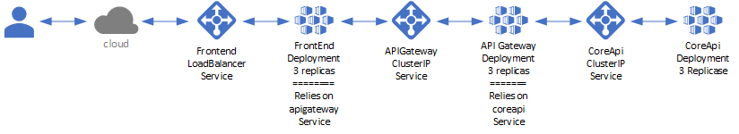

# AKS Demo

A sample solution leveraging Docker, ACR, and AKS.

## Concepts

- Docker
  - Build Images
  - Tag and Push Images
- AKS
  - Create Service Principal
  - Create AKS Cluster
    - Kubenet vs CNI
  - Create Azure Container Registry
- Kubernetes
  - Deployments
  - Services
    - LoadBalancer (Internal/External)
    - ClusterIP
## Solution Diagram



## Steps

- Develop and test the .Net Core services locally
  - Review the hostnames in FrontEnd to access the APIGateway, and in APIGateway to access the CoreAPI
- Create the service principal in Azure Cloud Shell
  - Run: ```sh create-service-principal.sh```
- Deploy AKS Cluster in Azure Cloud Shell
  - Run: ```sh deploy.sh```
  - Select kubenet or CNI
- Create an Azure Container Registry (ACR) in Azure Cloud Shell
  - Run: ```sh deploy-acr.sh```
- Create the docker files to build the images for:
  - FrontEnd: ```Dockerfile-FrontEnd```
  - APIGateway: ```Dockerfile-APIGateway```
  - Core.API: ```Dockerfile-CoreAPI```
- Build the docker images and push the images to ACR:
  - Run: ```build-images-and-push.sh``` 
- Test in Docker images with docker-compose
  - ```docker-compose up``` (docker-compose.yaml)
- Get Kubernetes credentials
  - ```az aks get-credentials --resource-group myResourceGroup --name myAKSCluster```
- Create YAML files for Kubernetes
  - Core.API
    - coreapi-deployment.yaml
    - coreapi-service.yaml
  - APIGateway
    - apigateway-deployment.yaml
    - apigateway-service.yaml 
  - FrontEnd
    - frontend-deployment.yaml
    - frontend-service.yaml 
- Deploy the kubernetes deployments and services:
  - ClusterIP Deployments and Services
      - ```kubectl apply -f coreapi-deployment.yaml```
      - ```kubectl apply -f coreapi-service.yaml```
      - ```kubectl apply -f apigwateway-deployment.yaml```
      - ```kubectl apply -f apigwateway-service.yaml```
  - LoadBalancer Deployment and Service
    - ```kubectl apply -f frontend-deployment.yaml```
    - ```kubectl apply -f frontend-service.yaml```
